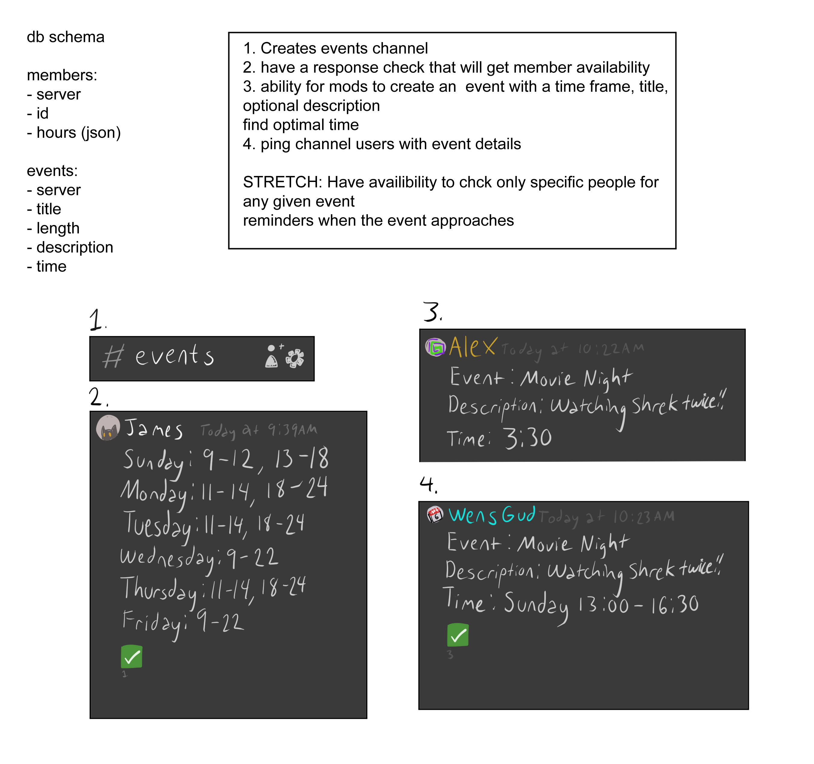

# Final Prep 4

## User Stories

* As a user, I want the ability to create a joinable event so that other users can join my event
* As a user, I want to be able to sign up for an event/cancel or drop out of an event created by another user
* As a user, I want to have the application analyze each user’s data and return an optimal time
* In a post Covid world the possibility of another lockdown happening is low but not zero percent, this bot would help with the coordination of work and play were another lockdown to occur
* If a member of a family can't travel for a holiday this event could help members coordinate, especially those who aren't tech ~savvy~
* As a person who wants to have movie night with friends I would like to be able to check everyone's availability
* With the new WOW Classic expansion I would like to be able to organize raid events with guild mates availability

## Domain Model

## Software Requirements

* OS library

* Discord library

* dotenv library

* Postgres database
